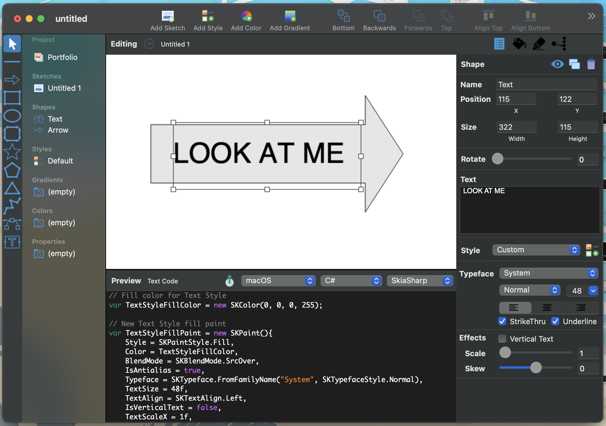

# Kimono Designer - .NET Edition

A port of [Kimono Designer](https://github.com/xamarin/kimonodesigner) to .NET Mac. This app lets you draw shapes to turn into Skia/SkiaSharp objects to use in your .NET applications.

This is experimental, I offer no support for this application. I did this as a way to try porting a larger scale Xamarin.Mac application into .NET.

## What works:

- Generating SkiaSharp code. If you draw in the canvas, the SkiaSharp code should generate and it (should) work in a application running SkiaSharp 2.81.
- Loading, Saving, Editing existing Kimono Designer documents from previous versions.
- Dark/Light mode. Some icons need to be updated.

## What's been removed
- Obiscript support has been turned off
- KimonoCore support has been turned off
- Unsupported features within Skia/SkiaSharp. For example, StrikeThru and Underline text is disabled as that was removed from Skia.

Both depended on support for libraries that I don't want to write/port/support/etc. At this point it would make more sense to use SkiaSharp directly than depend on middleware.

## What could be done
- Support for SkiaSharp 2.81/3.0 features
- Removal of older Skia/SkiaSharp features
- Translations

